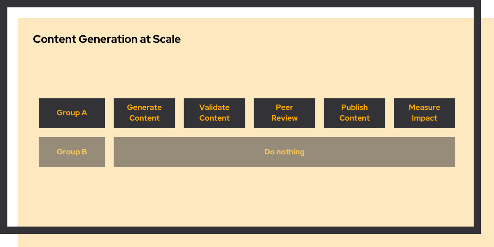

# Ai content generation at scale

<link rel="stylesheet" href="../../css/service-icons.css">

## Driving organic traffic with data-driven content generation

For bol.com, we built an innovative content generation system that created optimized content for millions of product pages. By combining generative AI with rigorous A/B testing, we significantly increased organic traffic while maintaining content quality and brand consistency.

This project demonstrates how AI can scale content operations while keeping humans in control of quality and strategy.

### The challenge

bol.com needed to optimize millions of product pages for search engines, but this presented unique challenges that made traditional approaches impossible:

**1. No A/B Testing for SEO** - Unlike typical experiments, Google indexes each page only once. We couldn't just run a standard A/B test. Instead, we had to find a way to group product pages into two similar groups that showed comparable behavior before making changes to only one group.

**2. Manual SEO at Scale** - With millions of products on bol.com, optimizing content for SEO is typically manual work requiring human expertise. We needed to find a way to achieve this at scale using LLMs while maintaining quality.

**3. Quality Assurance at Million-Page Scale** - When working at such massive scale, manually checking all generated content is impossible. Yet we needed to ensure correctness. We had to develop a system to guarantee 99%+ accuracy while flagging the <1% that needed human review.

**4. Keeping Content Fresh** - Once a successful experiment was rolled out to millions of pages, we needed a sustainable way to keep all that content up to date as products and market conditions changed.

### Our approach: make it work, make it better, make it scale

We tackled this challenge using our proven methodology, building a comprehensive end-to-end solution:

<strong>Group Sampling</strong> - Statistical methodology to create comparable test and control groups

<strong>Content Generation</strong> - LLM-powered content creation following brand guidelines

<strong>Content Validation</strong> - Automated quality checks to ensure accuracy and brand consistency

<strong>Peer Reviews</strong> - Human review process for flagged content

<strong>Publishing Content</strong> - Controlled deployment to production

<strong>Impact Measurement</strong> - Real-time tracking of organic traffic and business metrics

<strong>Rollout</strong> - Systematic scaling of winning experiments

<strong>Refresh</strong> - Automated updates to keep content current

### Why we're proud of this project

This project perfectly exemplifies our **Make it work → Make it better → Make it scale** methodology:

**Make it Work** - We proved that SEO optimization at scale with LLMs was technically feasible, solving the fundamental challenge of generating quality content automatically.

**Make it Better** - We applied rigorous experimentation methodology to measure real impact, developing innovative approaches to A/B testing for SEO that allowed us to validate effectiveness with statistical confidence.

**Make it Scale** - We built production-grade systems to run at millions-of-pages scale, maintained quality control, and embedded the solution into bol.com's way of working for sustainable long-term value.

The project delivered great results and became the starting point for a set of new experiments in the following year to further increase the impact of this new way of optimizing traffic.

### Project outcomes

**Results Achieved:**
- Significant increase in organic traffic
- Millions of pages optimized
- Roadmap for continued experimentation
- Scalable content operations embedded in workflow

**Technologies Used:**
- Python
- Statistical A/B Testing
- Generative AI (LLMs)
- SQL

### Key success factors

The project succeeded because we focused on iterations that combined content generation with content validation. This way, we were able to optimize for both the business impact, as well as operational impact. We built monitoring systems to detect quality issues early and established clear success metrics tied to business outcomes.

By treating AI as a tool that amplifies human judgment rather than replacing it, we achieved both scale and quality. The experimentation framework ensured we only deployed changes that demonstrably improved organic traffic.

