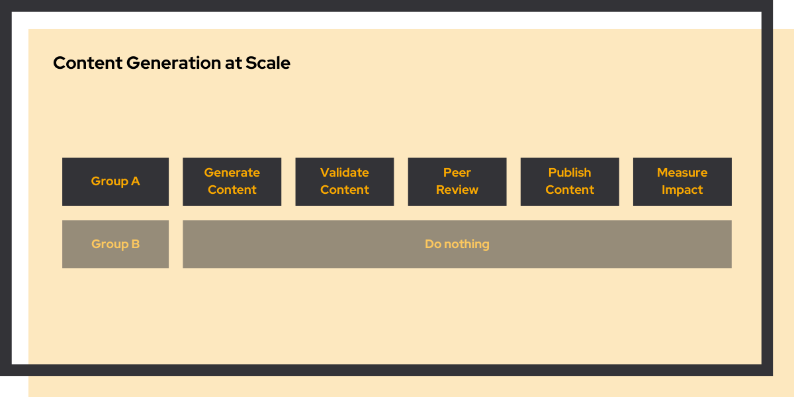

# AI content generation at scale

<link rel="stylesheet" href="../../css/service-icons.css">

## The ambition

bol.com wanted to grow organic traffic by improving content quality across their entire product catalogue. Millions of pages. Every one of them a potential SEO improvement. The ambition was clear. The scale made it feel impossible.

### The challenge

Optimizing content at this scale introduced three problems that ruled out every obvious solution:

**No standard A/B testing for SEO** — Google indexes each page once. Running a split test meant finding a way to group millions of product pages into statistically comparable sets before touching a single one.

**Manual work that doesn't scale** — Optimizing a product page takes time and expertise. At a million pages, that's over two years of full-time writing work. It needed to be automated without sacrificing quality.

**Quality assurance at scale** — When you generate content for millions of pages, you can't review them all. We needed a system that guaranteed accuracy while surfacing the small percentage that needed human eyes.

### Where we started

> Think big, start small.

We didn't begin with a million pages. We began with one experiment on one product category with one clear hypothesis: can AI-generated content outperform the existing copy on organic traffic?

To answer that, we built four things:

<strong>Group sampling</strong> — A statistical method to create comparable test and control groups from millions of pages, so results would be meaningful

<strong>Content generation</strong> — An LLM-powered pipeline that wrote optimized content following bol.com's brand guidelines

<strong>Content validation</strong> — Automated quality checks that guaranteed 99%+ accuracy and flagged the rest for human review

<strong>Impact measurement</strong> — Real-time tracking of organic traffic tied directly to business metrics

### Make it work, make it better, make it scale

The first experiment worked. Traffic went up. We measured it with statistical confidence.

From there, we made it better: refined the prompts, tightened the validation, improved the grouping methodology. Each iteration gave us a clearer picture of what moved the needle.

Then we scaled. The same system that ran one experiment on one category rolled out to millions of pages across the catalogue. What started as a proof of concept became bol.com's standard approach to content optimization. By the time we are finished, their team can run new experiments themselves.

