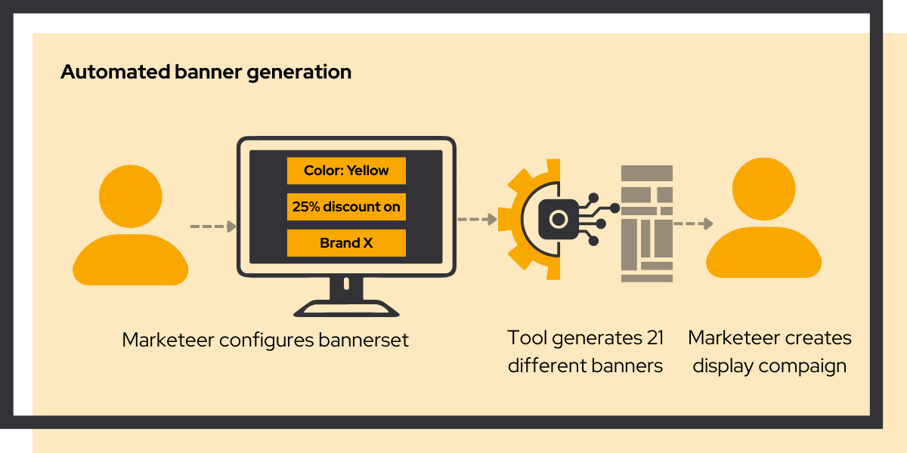

# Automated display banner generation

<link rel="stylesheet" href="../../css/service-icons.css">

## Scaling creative operations through automation

For bol.com, we developed a web app that automated display banner creation, generating 21 banners (instead of 1) in under 30 minutes. This enabled insourcing the process, massively reduced costs, and increased A/B testing capacity for marketing campaigns.

We started with the question: "Can we generate banner sets with AI?" And learned that the answer was much simpler. Simple automation allowed us to create banner sets quickly and efficiently.

### The challenge

bol.com relied on external agencies for display banner creation, it was slow and expensive. Each banner took significant time to produce, limiting the team's ability to run multiple A/B tests and optimize campaign performance.

The dependency on external agencies created a bottleneck: marketing teams had great ideas for testing different creatives, but the cost and turnaround time made experimentation impractical.

### Our approach: automation for scale

We built a simple web application that put banner creation in the hands of the advertising team:

<strong>Template System</strong> - Flexible templates following brand guidelines

<strong>Batch Processing</strong> - Generate 21 banner variations in one session

<strong>Quality Controls</strong> - Manual checks for brand compliance

<strong>Friendly Interface</strong> - Marketers can create banners without developer help

The tool enabled the marketing team to generate professional banners at scale without external dependencies.

### Why we're proud of this project

This project demonstrates how a big ideas can be turned into simple solutions, that can be built in three months, and deliver value from the very start.

**From Bottleneck to Advantage** - What was once a constraint (expensive, slow banner production) became a value driver. The team could now implement more display campaigns in the same time, against lower costs. Leading to efficiency gains and more revenue.

**Empowering Teams** - By giving marketers direct control over banner creation, we eliminated dependencies and reduced coordination overhead. Teams could move from idea to execution in minutes instead of days.

**Sustainable Impact** - The tool continues to deliver value after the initial project, enabling ongoing experimentation and cost savings.

### Project outcomes

**Results Achieved:**
- Significant cost savings
- Insourced banner production
- Increased display campaigns
- Increased A/B testing capacity

**Technologies Used:**
- Python
- Streamlit
- Kubernetes
- Docker

### Key success factors

The project succeeded because we focused on what marketers actually needed: a simple way to create professional banners quickly. We resisted the temptation to over-engineer and instead built a focused tool that did one thing well.

The automation also maintained brand consistency through built-in templates. This gave stakeholders confidence that self-service banner creation wouldn't compromise brand standards.

