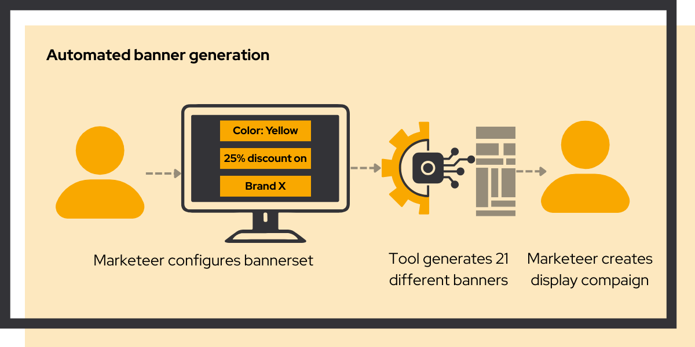

# Automated display banner generation

<link rel="stylesheet" href="../../css/service-icons.css">

## The ambition

bol.com's marketing team had more ideas for display campaigns than they could execute. Every banner took days and cost thousands through external agencies. The ambition: give the marketing team creative independence so they could test more, spend less, and move faster.

### The challenge

The dependency on external agencies created three problems that kept compounding:

**Every banner cost a week** — briefing, waiting, reviewing, revising. By the time a banner was ready, the campaign moment had often passed.

**A/B testing was practically impossible** — you can't test 21 banner variants when producing one costs a week of agency time. The team had hypotheses they could never validate.

**Insourcing felt risky** — handing banner creation to marketers without guardrails risked inconsistent quality and brand compliance issues.

### Where we started

> Think big, start small.

We didn't start by replacing the agency. We started with a single question: can a marketer produce a complete, brand-compliant banner set in under 30 minutes, without developer help?

To answer it, we built one focused tool:

<strong>Template system</strong> — Brand-compliant templates that handled sizing, fonts, and layout automatically

<strong>Batch generation</strong> — 21 banner variations produced in a single session

<strong>Built-in quality checks</strong> — Automated brand compliance before anything went out

<strong>Self-service interface</strong> — Marketers could create and export banners without touching a line of code

### Make it work, make it better, make it scale

The first version worked. A marketer could produce a complete banner set in under 30 minutes. What used to take a week of agency coordination now happened before lunch.

We refined it based on how the team actually used it: edge cases in the templates, export formats, workflow integration. Each iteration came from real usage, not assumptions.

Then it scaled naturally. Banner production moved in-house entirely. The team started running A/B tests they had never been able to run before. What started as a question about whether automation was possible became the standard way bol.com's marketing team worked. The agencies were no longer needed for this.

