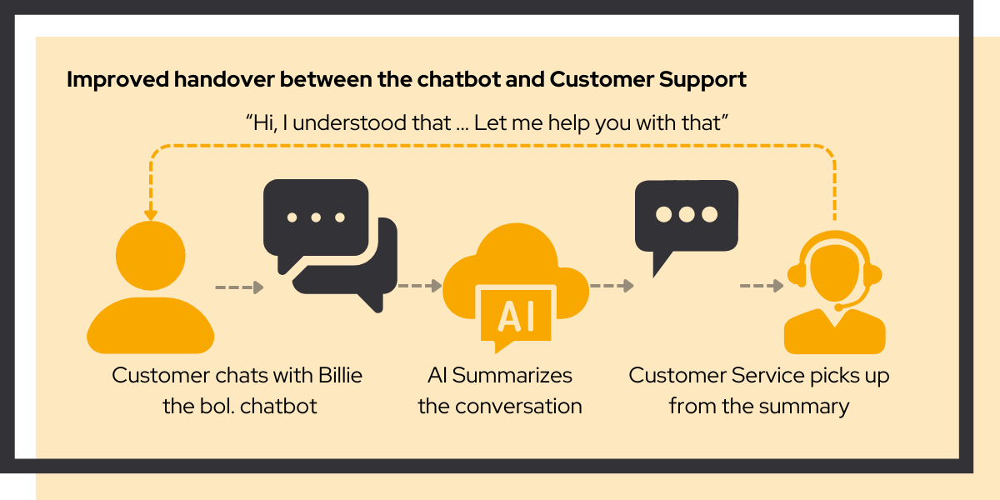

# Improving handover from chatbot to Customer Support

<link rel="stylesheet" href="../../css/service-icons.css">

## Improving handovers with generative AI

For bol.com, we improved handover between Billie the chatbot and the customer service agents. 

### The challenge

When customers needed human support after chatbot interaction, context was often lost in the handover. Customer service agents had to ask customers to repeat information, creating frustration and inefficiency.

Both customers and agents suffered: customers had to explain their issue again, while agents lacked the context they needed to help quickly. The challenge was to use AI to smooth this transition without requiring a large development effort.

### Our approach: iterative AI development

We developed a focused solution using generative AI, improving it week by week:

<strong>Conversation Summarization</strong> - AI summarizes chatbot conversation for human agents

<strong>Continuous feedback</strong> - Weekly refinement based on agent feedback

<strong>Simple integration</strong> - Add the summary as last message of the conversation to ensure seamless handover

### Why we're proud of this project

This project exemplifies our "start small, prove value" philosophy:

**Team effort** - Both IT and customer support teams worked together to design and implement the solution.

**Continuous Improvement** - Rather than building a perfect solution upfront, we iterated weekly based on real agent feedback. Each improvement was grounded in actual usage patterns.

**Sustainable Approach** - By adding the summary as the last message of the conversation, we could build upon existing infrastructure and processes, minimizing disruption and maximizing efficiency.

### Project outcomes

**Results Achieved:**
- Improved customer experience
- Increased agent efficiency
- Reduced handle time

**Technologies Used:**
- Python
- Generative AI

### Key success factors

The project succeeded because we focused on a specific, high value use case rather than trying to solve everything at once. By targeting the handover moment specifically, we could deliver meaningful improvements quickly.

The iterative approach also built trust. Stakeholders could see progress every week, and agents felt heard as their feedback directly shaped improvements. This created buy-in that would have been difficult to achieve with a large upfront project.

