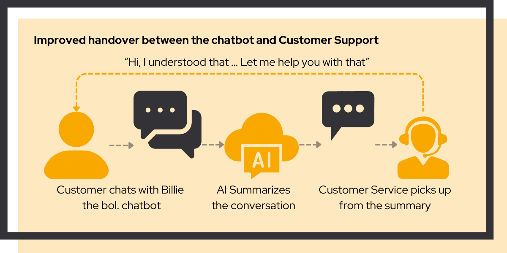

# Improving handover from chatbot to customer support

<link rel="stylesheet" href="../../css/service-icons.css">

## The ambition

Every time a customer escalated from bol.com's chatbot "Billie" to a human agent, the conversation started from zero. The customer repeated themselves. The agent started cold. The ambition: make the handover invisible — so the agent already knows what the customer needs before they say a word.

### The challenge

The problem was simple to describe and surprisingly hard to solve at scale:

**Context was lost at every handover** — Chatbot conversations weren't passed to agents in any usable form. Agents had to ask customers to repeat information they had already provided.

**Customers felt unheard** — Being asked to explain your problem twice, after already going through a chatbot, is a frustrating experience. It signalled that the systems weren't talking to each other.

**A large solution would take months** — Deeply integrating the chatbot and agent platform required sign-offs, development cycles, and coordination across multiple teams. We needed something that could work immediately, within existing infrastructure.

### Where we started

> Think big, start small.

Instead of rebuilding the handover integration, we asked: what's the simplest thing that could make the agent's first 30 seconds better? The answer: a plain-language summary of the chatbot conversation, delivered as the last message before handover.

<strong>Conversation summarization</strong> — Generative AI condenses the full chatbot conversation into a clear, agent-readable summary

<strong>Zero-friction integration</strong> — The summary is added as the last chatbot message, requiring no changes to the agent platform

<strong>Weekly refinement</strong> — Agents gave direct feedback each week, and the summaries improved based on what they actually found useful

### Make it work, make it better, make it scale

The first version worked immediately. Agents had context. Customers stopped having to repeat themselves. Handle time dropped.

What made this project unusually fast to improve was the feedback loop. Agents used the summaries every day and had direct opinions about what helped. We refined the prompts weekly: what to include, what to leave out, how to phrase the handover note for different issue types. Each week the summaries got more useful.

By the end, the system was running in production, agents trusted it, and the team managing Billie could maintain and improve it themselves. A problem that felt like it needed a major integration was solved with a focused AI feature and a tight feedback loop.

