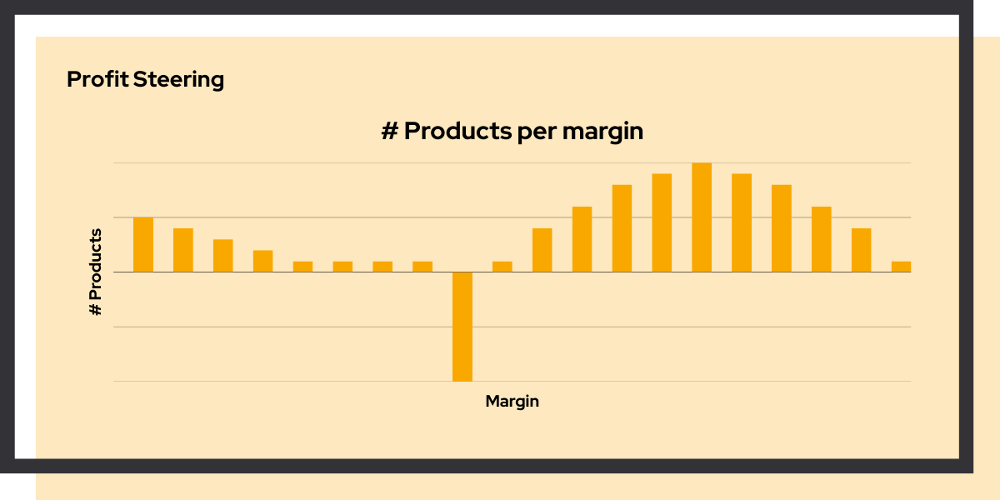

# Google Ads profit optimization

<link rel="stylesheet" href="../../css/service-icons.css">

## Strategic shift from revenue to profit steering

For bol.com, we conducted extensive data analyses of Google Ads and internal sales & finance data. We built a compelling business case to shift from revenue based to profit based steering, identifying significant cost savings opportunities.

This project demonstrates how deep data analysis can drive strategic decisions that fundamentally improve business outcomes.

### The challenge

bol.com optimized Google Ads based on revenue metrics (ROAS), which didn't account for product margins. This meant they also invested in advertising low, or negative margin products while underinvesting in high margin opportunities.

The team suspected that profit based steering would deliver better outcomes, but needed solid proof before making such a significant strategic change. Without data to back up the hypothesis, it was difficult to get stakeholder buy-in.

### Our approach: data driven business case

We combined data from multiple sources to build a compelling case for change:

<strong>Data Integration</strong> - Connected Google Ads, sales, and finance data

<strong>Profit Modeling</strong> - Calculated profit margin by product

<strong>Portfolio Analysis</strong> - Analyzed the advertised portfolio of products

<strong>Business Case</strong> - Quantified savings and presented recommendations

The result was a graph that slightly resembled a whale on a stick. The stick being a group of advertised products that were advertised, and never resulted in traffic to the website. This was a significant opportunity for improvement. There was also a group of products with negative margins, resulting in traffic that was not profitable.

### Organizational Challenge

Advertising was answering to the business, and the business did not want to exclude any product from the portfolio. Therefore, in order to optimize the advertising strategy, we had to find a way to balance the need for profitability with the need to include all products in the portfolio. We achieved this by grouping products into categories and optimizing the advertising strategy for each category separately. E.g. products that never resulted in traffic got very high ROAS targets. All in all the efficiency of the advertising strategy increased significantly, meaning that the company was able to generate more revenue and profit with the same budget.

### Why we're proud of this project

This project shows the power of connecting disparate data sources to answer strategic questions:

**Data as Decision Support** - By integrating Google Ads data with internal sales and finance information, we could calculate what really mattered: actual profit contribution per product category.

**Creative Solution** - We had to come up with a creative practical solution to balance the need for profitability with the need to include all products in the portfolio. 

**Lasting Impact** - The shift to profit based steering continues to improve advertising ROI, delivering ongoing value well beyond the initial analysis.

### Project outcomes

**Results Achieved:**
- Significant cost savings identified
- Strategic shift to more profit based steering
- Data driven business case
- Improved advertising ROI

**Technologies Used:**
- Python
- SQL
- Google Ads API
- Data Analysis

### Key success factors

The project succeeded because we focused on answering the right question: not just "how are our ads performing?" but "where is our ad spend actually generating profit?"

By framing the analysis around business impact rather than technical metrics, we made the findings actionable for decision makers. The clear business case removed friction from the strategic change.

