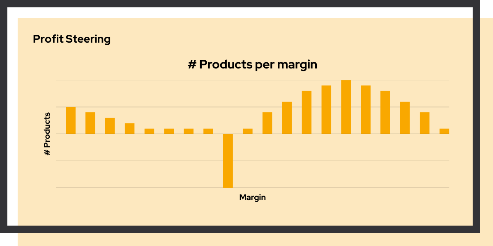

# Google Ads profit optimization

<link rel="stylesheet" href="../../css/service-icons.css">

## The ambition

bol.com was spending millions on Google Ads and wanted more return from the same budget. Not by spending more. By spending smarter. The ambition: find where the money was being wasted and redirect it toward products that actually generated profit.

### The challenge

The root cause turned out to be a measurement problem, and it had three layers:

**Optimizing for the wrong metric** — bol.com's Google Ads were steered on revenue (ROAS), not profit. That meant budget was actively flowing toward low-margin and even negative-margin products.

**The data didn't exist yet** — no one had connected Google Ads data to internal sales and margin data. The insight that some products cost more to advertise than they earned wasn't visible anywhere.

**The business didn't want to exclude products** — simply stopping ads on low-margin items wasn't acceptable. The solution had to work within a full-portfolio requirement.

### Where we started

> Think big, start small.

We didn't start with a new advertising strategy. We started by connecting three data sources that had never been joined before: Google Ads, internal sales data, and finance data. The question was simple: for each product, is the ad spend generating profit?

<strong>Data integration</strong> — Connected Google Ads, sales, and margin data into a single view

<strong>Profit modeling</strong> — Calculated actual profit contribution per product after ad spend

<strong>Portfolio analysis</strong> — Mapped the full advertised portfolio against profitability

<strong>Business case</strong> — Quantified the opportunity and presented recommendations with stakeholder buy-in

The analysis produced a striking visualization — a shape that slightly resembled a whale on a stick. The "stick" was a cluster of advertised products that never generated a single click. The "whale" included a group with negative margins. Together, they represented a significant and measurable opportunity.

### Make it work, make it better, make it scale

The data told the story. But turning it into action required solving the organizational constraint: the business still wanted all products in the portfolio. So instead of cutting products, we grouped them by profitability profile and set differentiated ROAS targets for each group. Products that never generated traffic got very high targets, effectively pricing them out of active bidding without removing them from the portfolio.

The first implementation worked. Efficiency improved without removing a single product.

From there we refined the groupings, tightened the methodology, and built the framework into ongoing operations. The shift from revenue to profit steering became the new standard. The advertising budget started working harder — generating more profit from the same spend — and it continued to do so long after the project ended.

