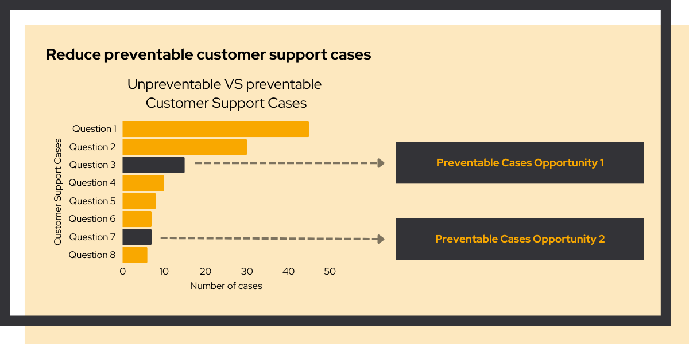

# Reducing Customer Support Workload

<link rel="stylesheet" href="../../css/service-icons.css">

## Reducing preventable support cases through smart experiments

For bol.com, we initiated A/B experiments on website account pages and in 'Billie' the AI chatbot. Through systematic experimentation, we significantly reduced preventable support cases, leading to massive cost savings while improving customer experience.

This project demonstrates the power of combining analytics capabilities with rigorous A/B testing to drive measurable business impact.

### The challenge

bol.com's customer service received many preventable questions that could be resolved through better self-service options. The challenge was to identify which interventions would reduce support volume while maintaining or improving customer satisfaction.

Customers would often contact support for issues they could resolve themselves if given the right tools or information at the right moment. This created unnecessary costs and longer wait times for customers with genuine support needs.

### Our approach: systematic experimentation

We developed a rigorous experimentation framework to test and validate each intervention:

<strong>Data Analysis</strong> - Identified patterns in preventable support cases

<strong>Hypothesis Generation</strong> - Developed interventions for account pages and chatbot

<strong>A/B Testing</strong> - Rigorously tested each intervention

<strong>Impact Measurement</strong> - Tracked support case reduction and customer satisfaction

By testing changes systematically, we ensured only effective interventions were deployed at scale.

### Why we're proud of this project

This project exemplifies our **Make it work → Make it better → Make it scale** methodology:

**Make it Work** - We started by identifying quick wins: small changes to account pages and chatbot responses that could immediately reduce support volume.

**Make it Better** - Through A/B testing, we validated which interventions actually moved the needle. This prevented the common mistake of deploying "improvements" that don't work or hurt customer experience.

**Make it Scale** - We established a framework for continuously identifying and testing improvements, creating sustainable long term value beyond the initial project.

### Project outcomes

**Results Achieved:**
- Massive cost savings
- Significant reduction in preventable cases
- Methodology for ongoing optimization
- Improved customer experience

**Technologies Used:**
- Python
- A/B Testing
- Analytics
- Statistical Analysis

### Key success factors

The project succeeded because we combined data analysis with rigorous experimentation. Rather than guessing which changes would help, we tested each intervention and measured its actual impact.

The methodology we established continues to deliver value. By embedding a testing culture into the team's workflow, bol.com can continuously identify and validate new improvements to their self-service experience.

