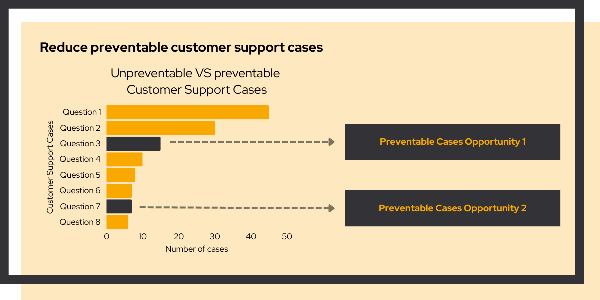

# Reducing preventable customer service cases

<link rel="stylesheet" href="../../css/service-icons.css">

## The ambition

bol.com's customer service handled millions of contacts per year. A significant share were preventable: customers reaching out for issues they could have resolved themselves, if given the right information at the right moment. The ambition: reduce that volume meaningfully, while improving the experience for customers who did need help.

### The challenge

The opportunity was clear. The path to it was not.

**Too many potential interventions** — Account pages, chatbot flows, email templates, order tracking. Dozens of touchpoints where something could be improved. Without data, there was no way to know where to start.

**Untested changes at scale carry real risk** — Deploying a "fix" to millions of customer journeys without validation risks making the experience worse. Every intervention needed proof before it went live.

**The chatbot was already in production** — bol.com's AI chatbot "Billie" was handling a large share of customer contacts. Any changes had to integrate carefully with existing infrastructure and workflows.

### Where we started

> Think big, start small.

We didn't try to fix everything at once. We started by finding the interventions with the highest potential impact and the lowest deployment risk — then tested each one rigorously before touching a single live customer.

<strong>Pattern analysis</strong> — Mapped the most common preventable contact reasons to specific moments in the customer journey

<strong>Intervention design</strong> — Developed targeted changes to account pages and chatbot responses for each pattern

<strong>A/B testing</strong> — Tested each intervention with statistical rigour before any rollout decision

<strong>Impact measurement</strong> — Tracked both support volume reduction and customer satisfaction in parallel

### Make it work, make it better, make it scale

The first experiments confirmed the hypothesis: targeted changes to account pages and chatbot responses could measurably reduce contact volume without harming satisfaction. We had proof before we touched anything at scale.

We then iterated on what worked — refining the interventions, expanding to new contact reasons, improving the chatbot flows. Each successful experiment became part of the permanent product.

The result was a framework, not just a set of fixes. By the time the engagement ended, the team had a repeatable method for identifying, testing, and rolling out improvements to the self-service experience. New preventable contact patterns could be addressed the same way, without us. The methodology stayed inside the organization.

