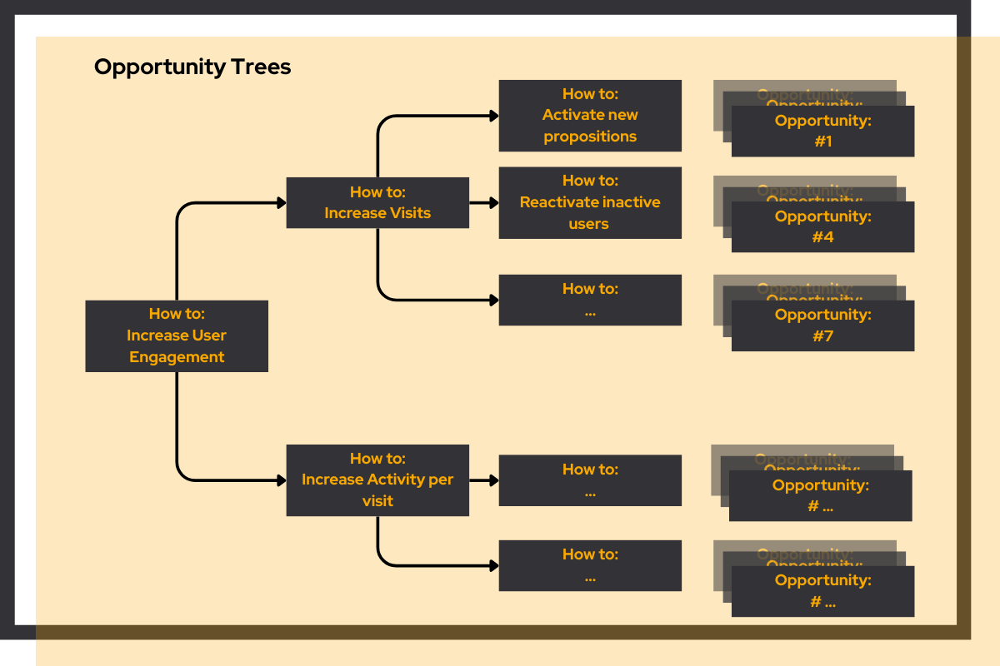

# Opportunity Finding

<link rel="stylesheet" href="../../css/service-icons.css">

## Data-driven product decisions at tikkie

For Tikkie, we identified and quantified opportunities to improve user engagement using data & analytics. By helping teams understand where to engage and where to relax, we enabled focus on high-impact activities that meaningfully improved user experience.

This project demonstrates how analytics can guide product strategy and prioritization decisions.

Client: Tikkie

Industry: Financial Services

Service: Experiment Execution

### The challenge

Tikkie wanted to improve user engagement but faced countless potential opportunities. Without data-driven prioritization, they risked investing in initiatives that wouldn't meaningfully impact user behavior. They needed analytics to guide where to focus efforts.

### Our approach

We developed a systematic approach to opportunity identification:

<strong>Structured opportunity finding</strong> - Create opportunity trees per domain

<strong>Opportunity Quantification</strong> - Sized impact of potential improvements

<strong>Prioritization</strong> - Ranked opportunities by impact and effort

<strong>Continuous Monitoring</strong> - Tracked engagement metrics over time

The analysis revealed where engagement efforts would deliver the highest impact.

### Project outcomes

**Results Achieved:**
- Improved user engagement
- Data-driven product decisions
- Insight in impact drivers
- Focused team efforts

**Technologies Used:**
- Python
- SQL
- Airflow
- DBT

**Platforms Used:**
- AWS
- Google Cloud Platform

### Strategic value

Our structured opportunity finding approach helped to identify and quantify opportunities. This way we helped teams to focus their efforts where they would deliver the highest return.

