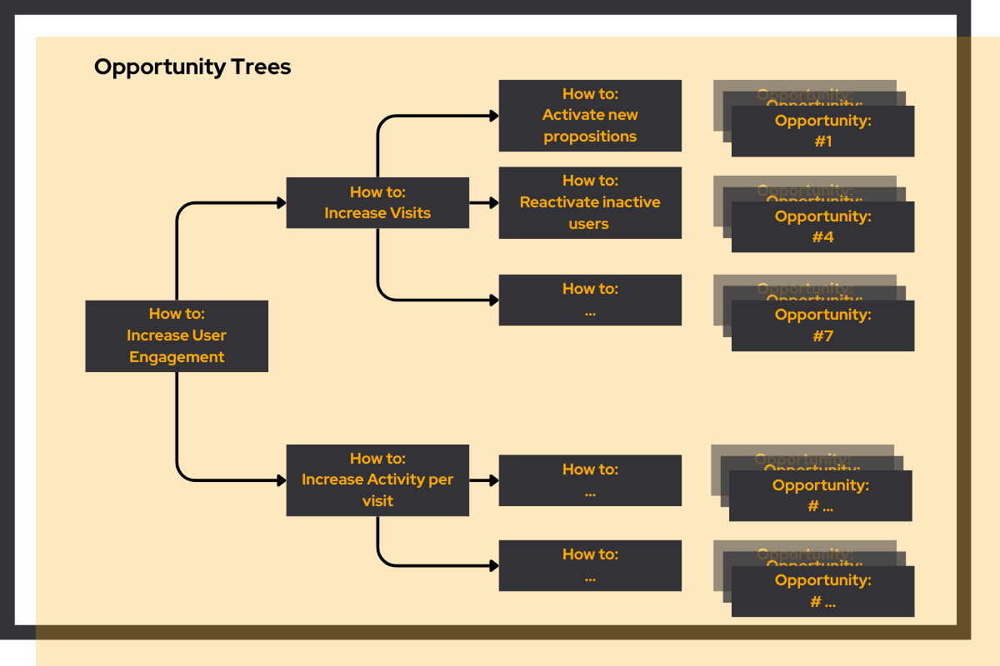

# Opportunity finding at Tikkie

<link rel="stylesheet" href="../../css/service-icons.css">

## The ambition

Tikkie wanted to grow user engagement. The product team had a long list of ideas — features to build, flows to improve, friction to remove. The ambition: stop guessing which ideas were worth pursuing and start making product decisions based on evidence.

### The challenge

The problem wasn't a lack of ideas. It was a lack of a way to compare them.

**Every discussion about priorities became a debate** — Without data on where engagement was actually breaking down, product decisions came down to opinion and seniority. The best argument won, not the best idea.

**Effort was going to the wrong places** — Teams were investing in improvements to parts of the product that weren't the real bottleneck. Meanwhile, high-impact opportunities were going unnoticed because they weren't obvious from the surface.

**No shared framework for evaluation** — Impact and feasibility were being assessed differently by different people. There was no common language for comparing a feature request to a conversion improvement to a retention problem.

### Where we started

> Think big, start small.

We didn't audit the entire product at once. We picked one domain, mapped where value was created and where it was leaking, and built an opportunity tree that quantified each finding.

<strong>Opportunity trees</strong> — Structured mapping of where engagement was gained or lost, domain by domain

<strong>Opportunity quantification</strong> — Each gap sized by user volume and potential impact, so comparisons were data-driven

<strong>Prioritization framework</strong> — Impact and feasibility scored consistently, giving teams a shared basis for decisions

<strong>Ongoing monitoring</strong> — Key engagement metrics tracked over time so the team could see whether the needle was moving

### Make it work, make it better, make it scale

The first opportunity tree changed how the team talked about priorities. Suddenly, "we should improve X" had a number attached to it. Debates became shorter. Decisions became easier to justify.

We expanded the approach to other domains, refining the methodology as we went. The trees got faster to build and the quantification more accurate as we learned what data was available and what proxies worked.

By the end, the team had internalized the framework. They could build opportunity trees themselves, update them as new data came in, and use them to align stakeholders without needing an analyst in every room. Product decisions at Tikkie started with evidence instead of ending with it.

