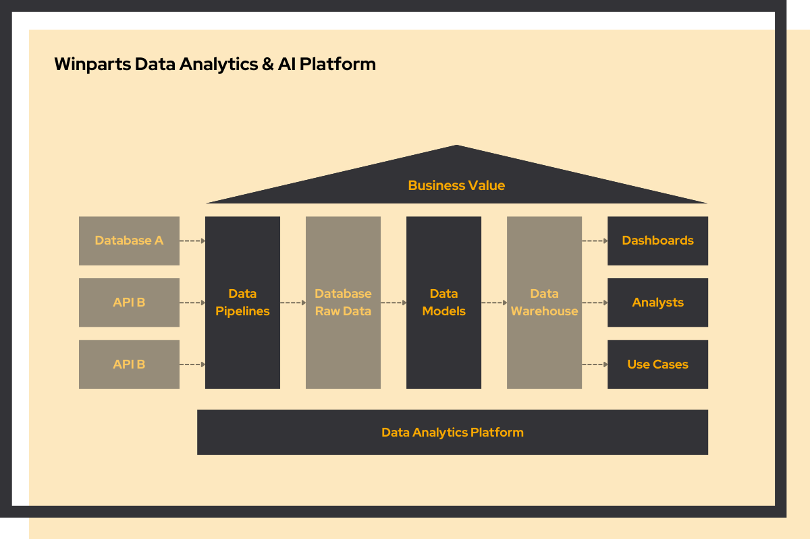

# Data & ai platform

<link rel="stylesheet" href="../../css/service-icons.css">

## Building the foundation for data-driven insights

For Winparts, we built a complete data and cloud infrastructure from the ground up, enabling the team to unlock valuable insights and lay the foundation for AI use cases. By creating robust data pipelines and reusable data models on secure enterprise infrastructure, we dramatically reduced time to insight.

This project transformed data from a scattered resource into a strategic asset accessible to analysts across the organization.

### The challenge

Winparts is a business-to-consumer webshop that sells car parts. Originally a Dutch company, it was acquired by Alliance Automotive Group, which is part of Genuine Parts Company (GPC). The B2C platform was now scaling from the Dutch market to the European market, bringing significant organizational and technical challenges.

**Corporate Infrastructure Alignment** - The acquisition by GPC made the company more corporate, directly impacting the data platform. The entire infrastructure needed to align with the parent organization's standards, including cloud organization, networking, security, user management, and governance frameworks.

**Building From Ground Zero** - The whole infrastructure needed to be created from scratch. This meant setting up the cloud organization, networking, security policies, access controls—the whole infrastructure foundation. Critical groundwork before any data pipeline could be created.

**Organizational Complexity** - The challenges were more organizational than technical. Corporate alignment, stakeholder coordination, security approvals, and establishing new ways of working all needed to be addressed before technical value could be delivered.

**Speed vs. Dependencies** - The team needed to deliver business value quickly, but was blocked by infrastructure dependencies. How could we prove value while waiting for corporate cloud infrastructure to be ready?

### Our approach: make it work, make it better, make it scale

We worked in two parallel tracks to overcome dependencies and accelerate delivery:

**Cloud Platform Track**

<strong>Cloud Organization</strong> - Setup of corporate-compliant cloud infrastructure

<strong>Networking & Security</strong> - Enterprise-grade security and network configuration

<strong>User Onboarding</strong> - Access management and governance frameworks

**Data Platform Track**

<strong>Data Pipelines</strong> - Automated ingestion from source systems

<strong>Data Models</strong> - Reusable analytical models for self-service

<strong>Returns Use Case</strong> - First value-adding use case optimizing returns process

### Why we're proud of this project

This project perfectly demonstrates how to navigate organizational complexity while delivering value:

**Make it Work** - To overcome infrastructure dependencies, we deployed the data platform infrastructure simultaneously with dummy data. This allowed us to prove the technical approach worked without being blocked by cloud platform dependencies. We validated the architecture, pipelines, and models in a safe environment.

**Make it Better** - Once the cloud platform was ready, we onboarded the first data engineer and first data analyst. We connected the first real data sources, built the first production data models, and created the first business insights—completing the returns use case that optimized the returns process.

**Make it Scale** - With the returns use case completed and infrastructure in place, the pace accelerated dramatically. New use cases could be onboarded quickly—each bringing new data sources, new models, and new insights. Analysts could answer more and more questions that weren't even part of the original use cases, at a much higher rate than before. One use case at a time, the data warehouse grew into a strategic asset.

The breakthrough was working in parallel tracks and using dummy data to de-risk dependencies. Once organizational groundwork was complete, the way was open for a broad range of value-adding use cases on sound, secure infrastructure at a much higher pace.

### Project outcomes

**Results Achieved:**
- Complete cloud platform setup aligned with GPC standards
- Production data platform with automated pipelines
- Returns use case optimized and delivered
- Dramatic reduction in time to insight
- Foundation for rapid expansion to new use cases
- Analyst self-service enabled

**Technologies Used:**
- Python
- SQL
- Cloud Infrastructure (GCP)
- Data Pipeline (dlt)
- Data Modeling (dbt)

### Key success factors

The project succeeded because we tackled organizational challenges head-on while finding creative ways to make technical progress. Working in parallel tracks with dummy data meant we weren't blocked waiting for approvals—we could prove the approach worked.

The two-track approach—cloud platform and data platform—allowed specialists to work simultaneously without dependencies. This dramatically accelerated delivery once both tracks converged.

Most importantly, we focused on completing one full use case (returns optimization) before scaling. This proved the entire system worked end-to-end and built organizational confidence. With that foundation in place, subsequent use cases deployed at a fraction of the time and cost.

The result: a platform that scales with the business, on enterprise-grade infrastructure, delivering insights faster than ever before.

## Build your data foundation right

This project demonstrates how to navigate corporate complexity while delivering rapid business value. The key is parallel workstreams, creative de-risking, and proving value with one complete use case before scaling.
