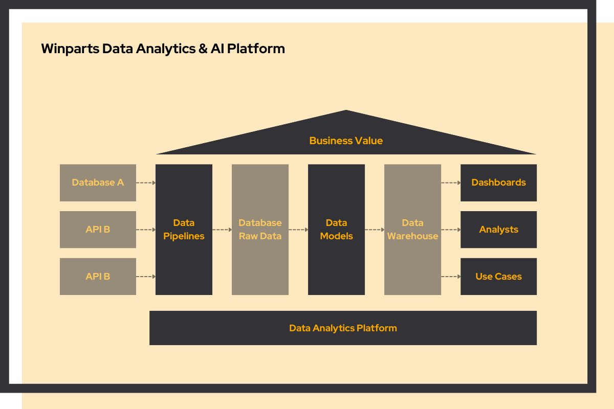

# Data & AI platform

<link rel="stylesheet" href="../../css/service-icons.css">

## The ambition

Winparts had been acquired by Alliance Automotive Group, part of Genuine Parts Company. The Dutch e-commerce platform was scaling to Europe. To do that, it needed a data foundation: proper infrastructure, automated pipelines, and the ability to answer business questions from data instead of gut feel. The ambition was clear. The path to it was blocked.

### The challenge

The technical work was straightforward. The organizational work was not.

**Build from zero, inside a corporate acquisition** — The entire cloud infrastructure needed to align with GPC's standards: cloud organization, networking, security, access management, governance. All of it had to be created before a single data pipeline could run.

**GCP-only with no externally hosted software** — Standard enterprise tools were off the table. Fivetran for data ingestion and Cloud Composer for orchestration were both ruled out. The platform had to be built differently, on a tighter budget.

**Blocked by approvals** — Corporate infrastructure couldn't be provisioned until sign-offs came through. The team needed to deliver business value, but the usual starting point wasn't available yet.

### Where we started

> Think big, start small.

We didn't wait. Instead of stalling on approvals, we ran two tracks in parallel: setting up the cloud infrastructure on one side, and building the data platform with dummy data on the other. By the time the real infrastructure was ready, the pipelines and models were already tested and proven.

**Cloud platform track**

<strong>Cloud organization</strong> — GPC-compliant infrastructure: networking, security, access controls, governance

**Data platform track**

<strong>Data pipelines</strong> — <a href="../blogs/why-dlt-beats-fivetran.html">DLT</a> on Cloud Run replacing Fivetran, saving roughly €15.000 per year

<strong>Data models</strong> — <a href="../blogs/dbt-transform-data-into-insights.html">DBT</a> for reusable analytical models and analyst self-service

<strong>Orchestration</strong> — Cloud Scheduler replacing Cloud Composer, saving roughly €5.000 per year

### Make it work, make it better, make it scale

When the cloud infrastructure was approved and ready, the data platform was already waiting. We connected the first real data sources, onboarded the first data engineer and analyst, and completed the returns use case: a full pipeline from raw data to business insight that optimized Winparts' returns process.

That first complete use case mattered more than it might seem. It proved the entire system worked end-to-end, built organizational confidence, and gave the team something real to show stakeholders.

From there, the pace accelerated. New use cases were onboarded in a fraction of the time. Analysts started answering questions that hadn't even been part of the original scope. The data warehouse grew into a strategic asset, use case by use case.

The platform now saves over €20.000 per year compared to the enterprise tools it replaced. More importantly, Winparts' team runs it themselves.

