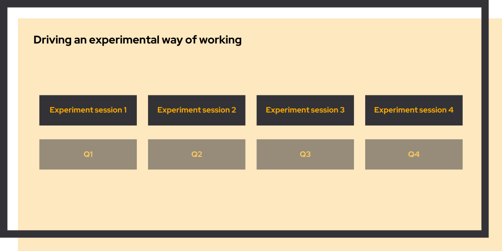

# Driving an experimental way of working

<link rel="stylesheet" href="../../css/service-icons.css">

## Transforming how teams validate ideas and drive improvement

For Winparts, we helped establish an experimental mindset across the organization. Through periodic coaching engagements, teams learned to test ideas rigorously, make decisions based on evidence, and continuously improve their processes. The result: a self-sustaining culture where experimentation drives business improvement.

This project shows how hands-on coaching can transform organizational culture while delivering immediate business value.

### The challenge

Winparts had plenty of ideas for improving their business, but no systematic way to validate which ones actually worked. Teams would implement changes based on intuition, without measuring impact or learning from results.

This led to wasted effort on initiatives that didn't move the needle, and missed opportunities to double down on what actually worked. They needed a way to separate promising ideas from assumptions.

### Our approach: learning by doing

We embedded experimentation into real work, coaching teams through actual experiments:

<strong>Opportunity Finding</strong> - Identified where small tests could reveal big insights

<strong>Experiment Design</strong> - Turned vague ideas into testable hypotheses

<strong>Execution Support</strong> - Guided implementation to ensure valid results

<strong>Results Analysis</strong> - Interpreted outcomes and identified next steps

Each quarter, teams completed real experiments while internalizing the methodology.

### Why we're proud of this project

This project demonstrates how cultural change happens through action, not training:

**Learning Through Real Work** - Teams didn't attend workshops about experimentation. They ran actual experiments on real business challenges, with coaching to ensure they learned the right lessons.

**Building Confidence** - Each successful experiment gave teams more confidence to test the next idea. Over time, experimentation became the default approach rather than an exception.

**Sustainable Change** - By the end of our engagement, teams could design and execute experiments independently. They started using experimentation tooling to better measure outcomes and iterate on their ideas. This way, the capability stayed in the organization and became a part of their daily work.

### Project outcomes

**Results Achieved:**
- Culture shift toward evidence based decisions
- Multiple validated improvements implemented
- Teams independently running experiments
- Reduced waste from untested assumptions

**Focus Areas:**
- Hypothesis development
- A/B testing methodology
- Impact measurement
- Iterative improvement

### Key success factors

The periodic cadence was essential. It gave teams enough time to implement and measure experiments while maintaining momentum. Regular touchpoints prevented experiments from stalling or losing focus.

We also focused on celebrating learning, not just wins. When an experiment disproved a hypothesis, that was valuable too. It prevented investment in initiatives that wouldn't have worked.

