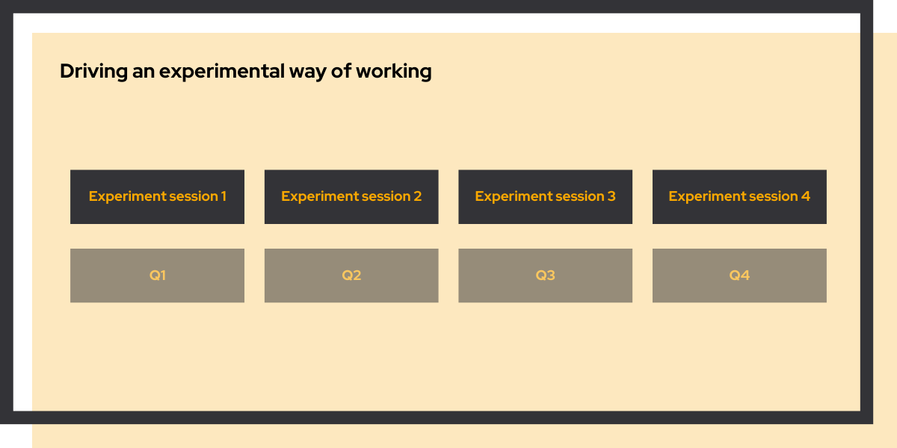

# Driving an experimental way of working

<link rel="stylesheet" href="../../css/service-icons.css">

## The ambition

Winparts wanted every team to make better decisions, faster. They had plenty of ideas for improving the business. What they lacked was a systematic way to know which ones actually worked. The ambition: build a culture where evidence, not instinct, drives what gets built.

### The challenge

The problem wasn't motivation. It was method.

**Changes were made without measuring impact** — Teams would implement improvements based on gut feeling, with no baseline and no way to know if anything moved. Good ideas and bad ideas looked the same afterward.

**No one knew how to design a proper experiment** — Turning a hunch into a testable hypothesis, with the right controls and success metrics, is a skill. It wasn't one the teams had yet.

**Learning wasn't accumulating** — Without a shared framework, the same assumptions kept getting made. Mistakes weren't recognized as mistakes because the feedback loop didn't close.

### Where we started

> Think big, start small.

We didn't run a training program. We coached teams through one real experiment on a real business challenge. The learning happened by doing, not by sitting in a workshop.

<strong>Opportunity finding</strong> — Identified where a small, well-scoped test could reveal a meaningful business insight

<strong>Experiment design</strong> — Turned vague ideas into testable hypotheses with clear success criteria

<strong>Guided execution</strong> — Supported implementation to ensure results would be valid and interpretable

<strong>Results analysis</strong> — Interpreted outcomes together and identified what to do next

Each quarter, teams ran a real experiment while building the skill to run the next one without us.

### Make it work, make it better, make it scale

The first experiment gave the team something they hadn't had before: a result they could trust. Not a gut feeling — a measured outcome with a clear next step.

Each quarter we refined the approach. The hypotheses got sharper. The test designs got cleaner. Teams stopped asking "what should we test?" and started generating their own backlog of ideas worth validating.

By the end of the engagement, teams were designing and running experiments independently. They had adopted experimentation tooling to track results and started embedding the methodology into their regular workflow. We stopped being needed. That was the point.

